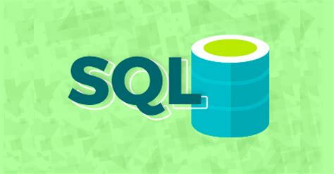

# SQL
## SQL Repository

### Created for my resumes, exercises and projects using SQL and Databases.

## Learning SQL

> In this repository I collect some interisting notebooks about SQL Language and some applications with python, SQLite and IBM DB2. They could be an example or a source for those who want to learn how to use the tool or consultation for those who already know!
 
## What's SQL?

> SQL (/ˌɛsˌkjuːˈɛl/ (About this soundlisten) S-Q-L,[4] /ˈsiːkwəl/ "sequel"; Structured Query Language)[5] is a domain-specific language used in programming and designed for managing data held in a relational database management system (RDBMS), or for stream processing in a relational data stream management system (RDSMS). It is particularly useful in handling structured data, i.e. data incorporating relations among entities and variables. (Wikipedia)

## Projects

### Mini Project 1 - Chicago Public Schools:
  #### Main Contents
  
    1.  Understand the dataset for Chicago Public School level performance
    2.  Store the dataset in an Db2 database on IBM Cloud instance
    3.  Retrieve metadata about tables and columns and query data from mixed case columns
    4.  Solve example problems to practice your SQL skills including using built-in database functions  
  
  #### What I learned:
  
    1.  How to work with a real word dataset using SQL and Python.
    2.  How to query columns with spaces or special characters in their names and with mixed case names.
    3.  How to use built in database functions and practiced how to sort, limit, and order result sets
    4.  How to use sub-queries and worked with multiple tables.

### Mini Project 2 - Chicago Socioeconomics Indicators:
  #### Main Contents
  
    1.  Understand a dataset of selected socioeconomic indicators in Chicago
    2.  Learn how to store data in an Db2 database on IBM Cloud instance
    3.  Solve example problems to practice your SQL skills
  
  #### What I learned:
  
    1.  How to store a real world data set from the internet in a database (Db2 on IBM Cloud),
    2.  How to Gain insights into data using SQL queries.
    3.  Visualized a portion of the data in the database to see what story it tells.

### Mini Project 3 - Chicago Data Analysis:
  #### Main Contents
  
    1.  Understand three Chicago datasets  
    2.  Load the three datasets into three tables in a Db2 database
    3.  Execute SQL queries to answer assignment questions 
  
  #### What I learned:
  
    1.  How to store 3 real world data sets from the internet in a database (Db2 on IBM Cloud),
    2.  How to answer business questions using SQL queries.
   
## File Contents:

* Connect_Query_Display_with_Pandas:
  * Established a connection to a database instance of DB2 Warehouse on Cloud from a Python notebook using ibm_db API
  * Create a table in the database
  * Insert data into the table
  * Query data in the table
  * Retrieve data into Pandas
* Built-IN FUNCTIONS AND SUBQUERIES IN SQL:
  * Aggregate, Scalar, String, Date and Time Functions
  * Sub-queries and Nested Selects
* JOINS:
  * Joins in SQL:
    * INNER JOIN
    * OUTER JOIN
    * LEFT JOIN
    * RIGHT JOIN
    * CROSS JOIN
* HR_Database_Create_Tables_Script:
  * Script to create tables for HR Database
* PETRESCUE_CREATE:
  * Script to create tables for PETRESCUE Database
* SQL - DDL COMMANDS:
  * CREATE TABLE
  * ALTER TABLE
  * TRUNCATE TABLE
  * DROP TABLE
  * Synthax and solving some problems
* SQL - DML COMMANDS:
  * SELECT
  * COUNT
  * DISTINCT
  * LIMIT
  * INSERT
  * UPDATE
  * DELETE
  * Synthax and solving some problems         
* SQL Magic:
  * What's is SQL Magic? 
  * Accessing Databases with SQL Magic
* SQL_and_Python:
  *  With SQLite and Python, how to:
    * Connect DBases, Create DBases, Insert, Select, Update, INNER JOIN, LEFT OUTER JOIN, CROSS JOIN or CARTESIAN JOIN   
* String Patterns, Sorting and Grouping in SQL:
  * LIKE, BETWEEN, %
  * ORDER BY
  * GROUP BY
  * HAVING 
* Working with Data in Python:
  * Acessing Data with Python and API's
  * SQL API COMMANDS
  * Writing code using DB-API
  * Creating tables, loading data and querying data with PANDAS
  * Using SQL magic commands 
* Working with multiple tables:
  * Write SQL queries that access more than one table
  * Compose queries that access multiple tables using a nested statement in the WHERE clause
  * Build queries with multiple tables in the FROM clause
  * Write Implicit Join queries with join criteria specified in the WHERE clause
  * Specify aliases for table names and qualify column names with table aliases

## Contacts:

Wanderson Torres
* [Github](https://github.com/wantor-stack)
* [LinkedIn](https://www.linkedin.com/in/wanderson-torres-31049522/)

=)

## License
This project could be used by anyone! MIT License
